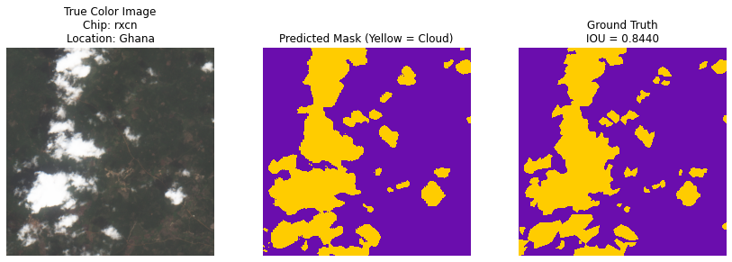
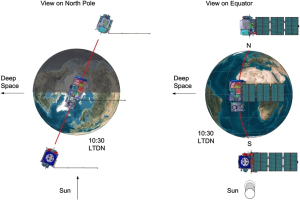
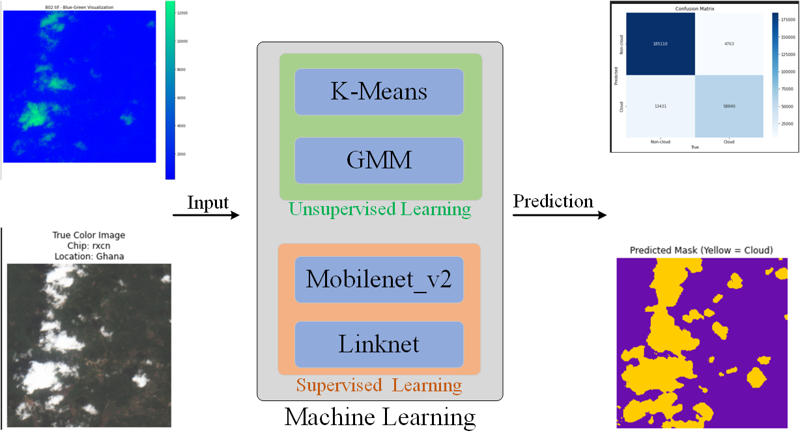

# AI-Final-Assignment_
<!-- 
<div style="text-align:center;">
  <h3>Cloud Cover Detection with ML and CNN</h3>
</div>
<hr style="border: 1px solid #ffffff;"> -->

<!-- <p align="center">
  
</p>

<div style="text-align: center; margin-bottom: 4px;">
  <h3 style="margin-bottom: 4px;">Cloud Cover Detection with ML and CNN</h3>
  <hr style="width: 30%; margin: 4px auto; border: 0.5px solid #ccc;">
</div> -->

<p align="center">
  
</p>

<div style="text-align: center; margin-bottom: 2px;">
  <h3 style="margin-bottom: 6px;">Cloud Cover Detection with ML and CNN</h3>
  <hr style="width: 90%; height: 0.5px; background-color: #ddd; border: none; margin: 2px auto;">
</div>

<br>
<details>
  <summary><strong>Table of Contents</strong></summary>

1. [Project Description](#project-description)  
   - [Background](#background)  
   - [Remote Sensing Technique](#remote-sensing-technique)  
   - [AI Algorithm](#ai-algorithm)  
2. [Getting Started](#getting-started)  
   - [Prerequisites](#prerequisites)
   - [Datasets](#datasets)  
   - [Metrics](#metrics)  
   - [Usage](#usage)
<!-- 3. [Usage](#usage)   -->
<!-- 4. [License](#license)  
5. [Contact](#contact)   -->
<!-- 6. [Acknowledgments](#acknowledgments)   -->
3. [Conclusion](#conclusion)
4. [References](#references)  

</details>

#### Project Description
This project is the end-of-year assignment for **GEOL0069: AI for Earth Observation**.  
We explore both unsupervised methods (K-Means, Gaussian Mixture Model) and supervised deep learning (Convolutional Neural Networks) to label clouds in satellite imagery.
Cloud removal in satellite images enables clearer analysis for critical Earth observation applications such as:
- Wildfire tracking  
- Deforestation mapping  
- Crop health monitoring

The satellite data used in this project is sourced from the **Sentinel-2 mission**, which provides wide-swath, high-resolution, multi-spectral imagery of the Earth's surface.


#### Background

Satellite imagery is critical for a wide variety of applications—from disaster response and agricultural planning to environmental monitoring and military intelligence. However, one of the major obstacles in leveraging satellite imagery is cloud coverage, which obscures over 66% of Earth’s surface at any given time ([Xie et al., 2020](https://amt.copernicus.org/articles/13/1953/2020/)). Clouds introduce noise and reduce the accuracy of image-based models, making cloud detection and removal an essential preprocessing step.

Improving cloud identification methods can significantly enhance the utility of satellite imagery, enabling faster, more efficient, and more accurate insights across a wide range of domains.

This project uses data from the Sentinel-2 satellite mission, which monitors land surface conditions and their changes over time. Sentinel-2 imagery has been pivotal in a variety of real-world applications, such as:

- Tracking lava flow during the volcanic eruption on La Palma, aiding evacuation efforts  
- Mapping deforestation in the Amazon rainforest to evaluate conservation strategies  
- Monitoring California wildfires and tracking air pollution patterns

One of the most significant challenges in cloud detection is differentiating between thin or semi-transparent clouds and other bright features like snow or sand ([Kristollari & Karathanassi, 2020](https://www.spiedigitallibrary.org/conference-proceedings-of-spie/11524/115240K/Convolutional-neural-networks-for-detecting-challenging-cases-in-cloud-masking/10.1117/12.2571111.full?SSO=1)).

#### Remote Sensing Technique

This project leverages imagery from the Sentinel-2 satellite mission, which consists of two wide-swath, high-resolution, multi-spectral imaging satellites equipped with MultiSpectral Instruments (MSI). These instruments collect data by measuring sunlight reflected from the Earth's surface and split the incoming light into 13 spectral bands:

- 4 visible bands (including red, green, and blue)  
- 6 Near-Infrared (NIR) bands  
- 3 Short-Wave Infrared (SWIR) bands  
<p align="center">
  <br>
  <em>
    The Twin-Satellite SENTINEL-2 Orbital Configuration (courtesy Astrium GmbH).
    Image source: <a href="https://sentinel.esa.int/web/sentinel/missions/sentinel-2/overview">Sentinel-2 Overview</a>
  </em>
</p>

Sentinel-2 provides two types of atmospheric reflectance data:

- **Level-1C (L1C)**: Top-of-Atmosphere (TOA) reflectance  
- **Level-2A (L2A)**: Bottom-of-Atmosphere (BOA) reflectance  

All imagery used in this project comes from Level-2A data, which has been atmospherically corrected to represent surface reflectance.

Both satellites follow a **sun-synchronous orbit**, ensuring consistent solar illumination angles across image captures. Positioned on opposite sides of the same orbit, the satellites improve temporal resolution by increasing revisit frequency for the same geographic region—an important factor in monitoring dynamic land surface changes with minimal shadow variation.

#### AI Algorithm

<p align="center">
  <br>
  <em>
    Cloud segmentation with AI algorithm
     Overview</a>
  </em>
</p>
We adopted three different algorithms—K-Means, Gaussian Mixture Model (GMM), and Convolutional Neural Networks (CNN)—to perform segmentation on cloud imagery.

K-Means is an unsupervised clustering algorithm that partitions data into K groups by minimizing the distance between each data point and the centroid of its assigned cluster. A Gaussian Mixture Model is a probabilistic model that assumes all data points are generated from a mixture of a finite number of Gaussian distributions with unknown parameters. For the CNN-based deep learning approach, we employed the LinkNet architecture with MobileNetV2 as the backbone, resulting in an efficient and lightweight segmentation network.

#### Getting Started
##### Prerequisites

To ensure the program runs correctly, you need to install the following dependencies:

- numpy 1.23.4  
- torch 1.12.1  
- matplotlib 3.4.3  
- rasterio 1.4.3  

You can install them using commands like the one below:

```
pip install rasterio==1.4.3
```
##### Datasets
This project uses the **Sentinel-2 Cloud Cover Segmentation Dataset**, which can be downloaded using the following method:
```
https://source.coop/repositories/radiantearth/cloud-cover-detection-challenge/description
```

Overview of the data provided for this competition:
```plaintext
.
├── train_features
│   └── ...
├── train_labels
│   └── ...
└── train_metadata.csv
```
##### Metrics
To measure the model's performance, we use a metric called **Jaccard index**, also known as **Generalized Intersection over Union (IoU)**.

The Jaccard index can be calculated as follows:

$$
J(A,B) = \frac{|A \cap B|}{|A \cup B|} = \frac{|A \cap B|}{|A| + |B| - |A \cap B|}
$$

Where:
- \( A \) is the set of true pixels
- \( B \) is the set of predicted pixels

##### Usage
1. **Download the `.ipynb` file from GitHub.**
2. **Extract the dataset** from the provided archive file.
3. **Update the dataset path** in the code to match your local dataset directory.
4. **Run the code cell by cell in the notebook.**

#### Conclusion
We conducted a comprehensive comparison of unsupervised and supervised methods for cloud segmentation. For the unsupervised approach, we implemented K-means and Gaussian Mixture Model (GMM) clustering techniques, while the supervised approach utilized a deep learning-based Convolutional Neural Network (CNN) model. Specifically, we developed a cloud segmentation model based on the LinkNet architecture with MobileNet_v2 as the encoder. The results on the validation set show that the CNN-based model achieves an Intersection over Union (IOU) of 84.4, significantly outperforming the unsupervised methods and demonstrating the effectiveness of deep learning for cloud segmentation tasks.

#### References
- [DrivenData Cloud Cover Benchmark](https://drivendata.co/blog/cloud-cover-benchmark/)
- *On Cloud N: Cloud Cover Detection Challenge*. DrivenData. [https://www.drivendata.org/competitions/83/cloud-cover/](https://www.drivendata.org/competitions/83/cloud-cover/)
- MacQueen, James. "Some methods for classification and analysis of multivariate observations." Proceedings of the Fifth Berkeley Symposium on Mathematical Statistics and Probability, Volume 1: Statistics. Vol. 5. University of California press, 1967.
- Reynolds, Douglas A. "Gaussian mixture models." Encyclopedia of biometrics 741.659-663 (2009): 3.

- Chaurasia, Abhishek, and Eugenio Culurciello. *LinkNet: Exploiting Encoder Representations for Efficient Semantic Segmentation.* 2017 IEEE Visual Communications and Image Processing (VCIP). IEEE, 2017.

- Sandler, Mark, et al. *MobileNetV2: Inverted Residuals and Linear Bottlenecks.* Proceedings of the IEEE Conference on Computer Vision and Pattern Recognition. 2018.


